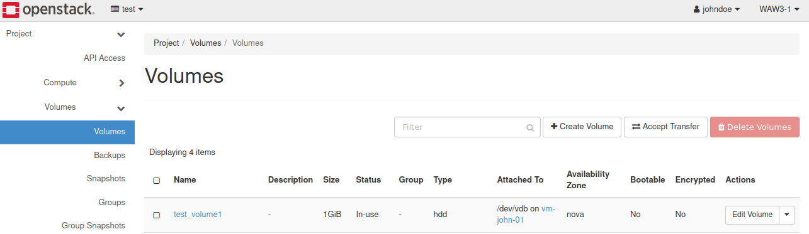
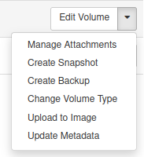
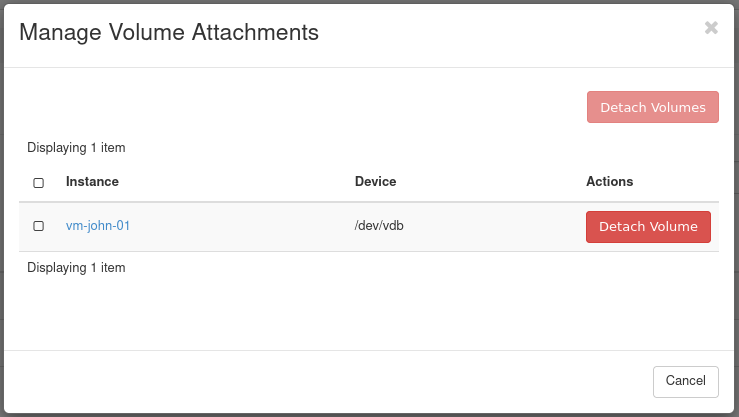
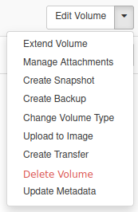
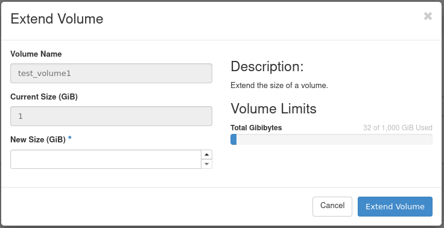
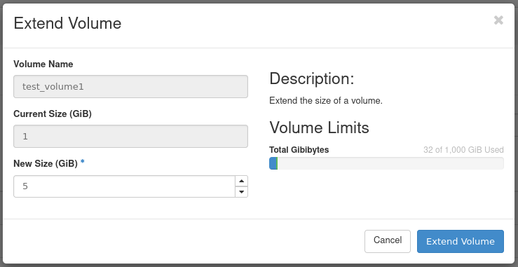

How to extend the volume (Linux)?
==================================

It is possible to extend the Volume from Horizon dashboard.

Another method is to create a new volume, attach it to the VM, copy all the data from the old volume to the new one, check if the data is properly copied, then detach and delete the old one. Not all filesystems are resizable.

.. warning::

   1. It is strongly recommended to backup the volume by creating Volume Snapshot before proceeding with extending the volume.
   
.. warning::

   2. If you have a volume < 2TB and you want to extend it above 2TB, please do not follow below instructions. Instead please create a new volume, format it according to another article: `HOW TO ATTACH A VOLUME TO VM (>2TB) ON LINUX? <https://creodias.eu/-/how-to-attach-a-volume-to-vm-2tb-linux->`_, attach it to the VM, copy the data from the old volume to the new one, check if it is fully copied, detach and delete the old volume.
 

You may use following guide to backup the volume:

`How to create volume Snapshot? <https://cloudferro-cf3.readthedocs-hosted.com/en/latest/datavolume/volumesnapshot/volumesnapshot.html>`_

 

**Resizing the volume:**

In this tutorial we will resize 1GB volume to 5GB.

First we need to extend the volume in Horizon.

Lets say that we have 1GB volume attached to our instance as /dev/vdb

And we have it mounted in our Linux machine as /dev/vdb1

::

   eouser@vm-john-01:~$ df -kh
   Filesystem      Size  Used Avail Use% Mounted on
   udev            1.9G     0  1.9G   0% /dev
   tmpfs           394M  640K  393M   1% /run
   /dev/vda1        15G  2.7G   12G  19% /
   tmpfs           2.0G     0  2.0G   0% /dev/shm
   tmpfs           5.0M     0  5.0M   0% /run/lock
   tmpfs           2.0G     0  2.0G   0% /sys/fs/cgroup
   tmpfs           394M     0  394M   0% /run/user/1001
   tmpfs           394M     0  394M   0% /run/user/1000
   /dev/vdb1       991M  2.6M  922M   1% /my_volume
   
We already have some data on it, we don't want to lose.

First we need to unmount it in Linux:

::

   eouser@vm-john-01:~$ sudo umount /dev/vdb1

 
Then detach it in Horizon by clicking "Manage Attachments" > "Detach Volume"

   

After detaching we will have "Extend Volume" option available.

   

We enter new size, for example 5GB and click "Extend Volume"

Our new volume size is now 5GB.
Attach it to your Virtual Machine again.
Now we need to extend our /dev/vdb partition in Linux.

Expand the modified partition using **growpart** (and note the unusual syntax of separating the device name from the partition number):

::

   eouser@vm-john-01:~$ sudo growpart /dev/vdb 1
   CHANGED: partition=1 start=2048 old: size=2095104 end=2097152 new: size=10483679 end=10485727
   
Next use resize2fs:

::

   eouser@vm-john-01:~$ sudo resize2fs /dev/vdb1
   resize2fs 1.45.5 (07-Jan-2020)
   Please run 'e2fsck -f /dev/vdb1' first.
   
Most of the time a filesystem check will be recommended by the system.

::

   eouser@vm-john-01:~$ sudo e2fsck -f /dev/vdb1
   e2fsck 1.45.5 (07-Jan-2020)
   Pass 1: Checking inodes, blocks, and sizes
   Pass 2: Checking directory structure
   Pass 3: Checking directory connectivity
   Pass 4: Checking reference counts
   Pass 5: Checking group summary information
   /dev/vdb1: 11/65536 files (0.0% non-contiguous), 8859/261888 blocks
   
After doing e2fsck we proceed with extending partition:

::

   eouser@vm-john-01:~$ sudo resize2fs /dev/vdb1
   resize2fs 1.45.5 (07-Jan-2020)
   Resizing the filesystem on /dev/vdb1 to 1310459 (4k) blocks.
   The filesystem on /dev/vdb1 is now 1310459 (4k) blocks long.
   
We can now mount our extended volume again.

::

   eouser@vm-john-01:~$ sudo mount /dev/vdb1

::

   eouser@vm-john-01:~$ sudo df -kh
   Filesystem      Size  Used Avail Use% Mounted on
   udev            1.9G     0  1.9G   0% /dev
   tmpfs           394M  640K  393M   1% /run
   /dev/vda1        15G  2.7G   12G  19% /
   tmpfs           2.0G     0  2.0G   0% /dev/shm
   tmpfs           5.0M     0  5.0M   0% /run/lock
   tmpfs           2.0G     0  2.0G   0% /sys/fs/cgroup
   tmpfs           394M     0  394M   0% /run/user/1001
   tmpfs           394M     0  394M   0% /run/user/1000
   /dev/vdb1       5.0G  4.0M  4.7G   1% /my_volume
   
The new size is now 5GB and the data that were previously there are intact.

   
   
