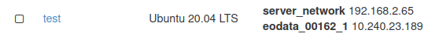

HOW TO ACCESS EARTH OBSERVATION DATA (EODATA)?
==============================================
EODATA folder is automatically mounted when your VM is spawned.
To access it you have to make sure that "eodata_*your-projectID*" interface is attached to VM.

