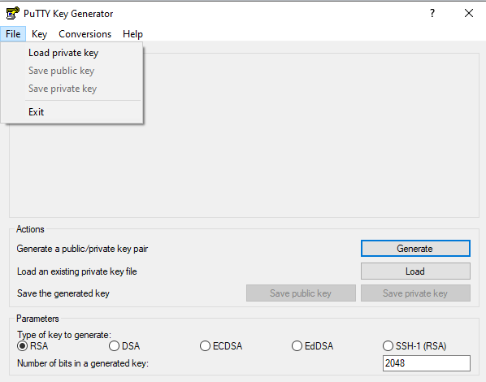
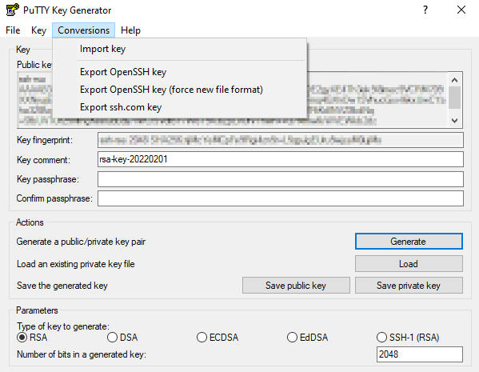
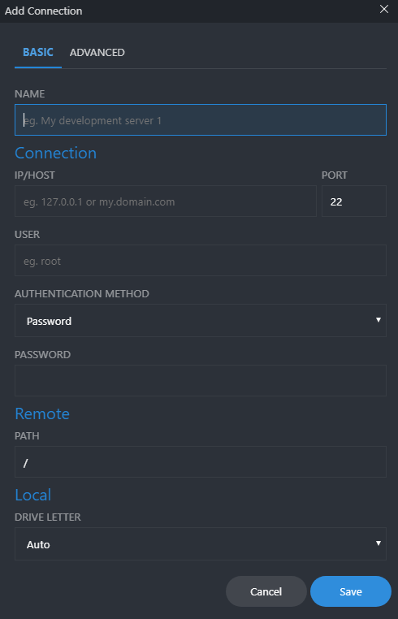
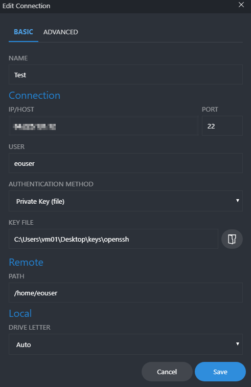
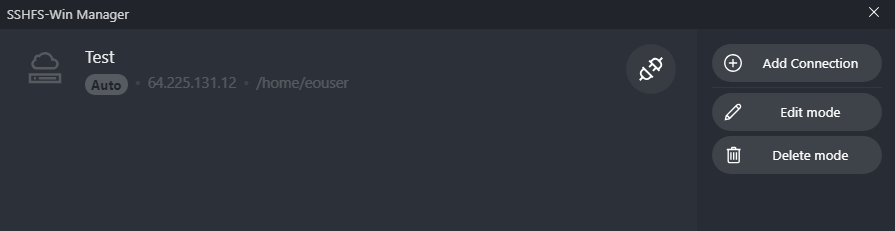
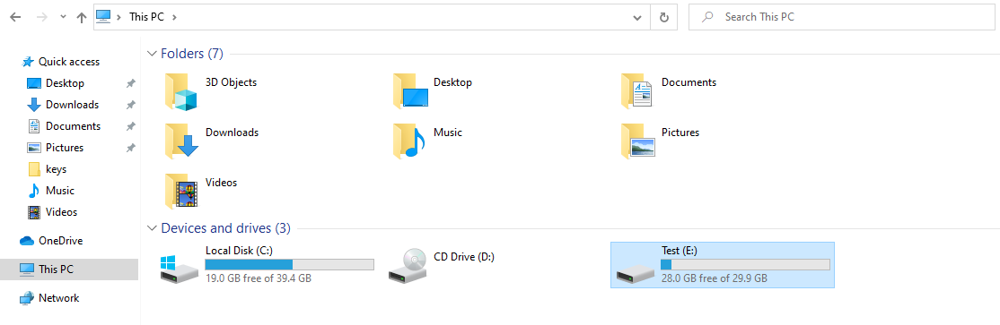

How to mount Network Drive over SSH in Windows?
===============================================

**You can mount VM disk to your system using SSH.**

To do that you have to download and install following programs:

* Putty `download <https://www.putty.org/>`_
* Dokan
* WinFsp
* SSHFS-Win-Manager (to Authenticate using OpenSSH Key)

**Firsly you have to convert your Private Key to OpenSSH format.**

To do that please launch PuTTy KeyGenerator then choose your Private Key by going to *file* - *Load Private Key*

Then Please export your Private Key by going to *Conversions* and then *Export OpenSSH key*.

**After that you can close PuTTy and open SSHFS-Win-Manager**

To add new connection simply click on *Add Connection*

Then you'll see window where you can specify all connection details.

Here's a short description of the options.

* **Name** - you can specify connection name
* **IP/HOST** - that's simply your VM floating IP
* **PORT** - default it's 22 (SSH port number)
* **USER** - specify user to authenticate
* **AUTHENTICATION METHOD** - you can choose two authentication methods (by password or using OpenSSH key)
* **PATH** - set path to Directory that you want to mount
* **DRIVE LETTER** - you choose on which letter the new drive will be named 

eg.

Under **KEY FILE** option i choosed path to OpenSSH key file.
Then click save. You'll see that new connection has been made.

Then just click link button. And your drive sholud be mounted.

