How to create new linux vm with vGpu in Openstack Dashboard (Horizon)?
======================================================================

A virtual machine with vgpu differs from normal virtual machines in that it has a graphics card. In order to use this functionality, you will need to select a flavour that has this card. The flavor names are: vm.a6000.1, vm.a6000.2, vm.a6000.4, vm.a6000.8. a6000 means the presence of NVIDIA RTX A6000 and 1, 2, 4, 8 are the flavor capacities.

Go to Project → Compute → Instances.

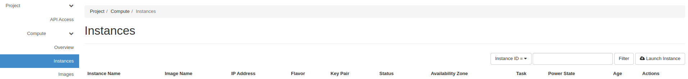

Click "Launch Instance".

Insert the name of the Instance (eg. "vm_with_vgpu") and click Next button.

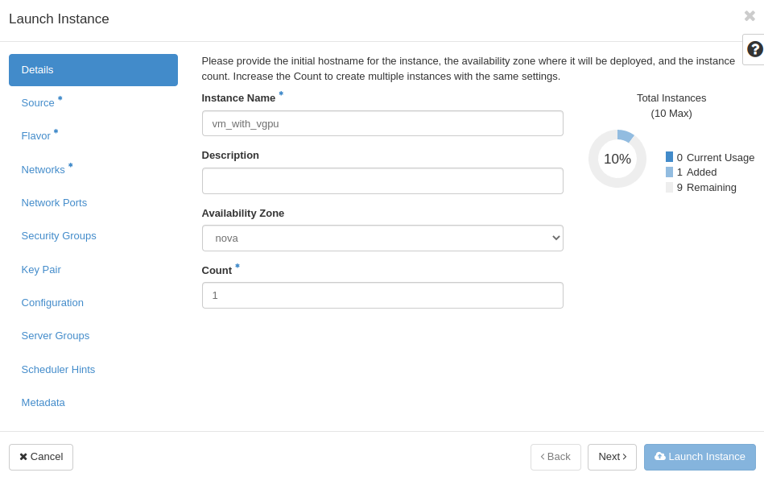

Select Instance Boot Source (eg. "Image"), and choose desired image (eg. "Ubuntu 20.04 NVIDIA") by clicking on arrow.
If you do not need to have the system disk bigger than the size defined in a chosen flavor, we recommend setting "Create New Volume" feature to "No" state.

Images marked with "NVIDIA" have the special NVIDIA Grid drivers and a licence token installed, the CUDA library is also installed in these images

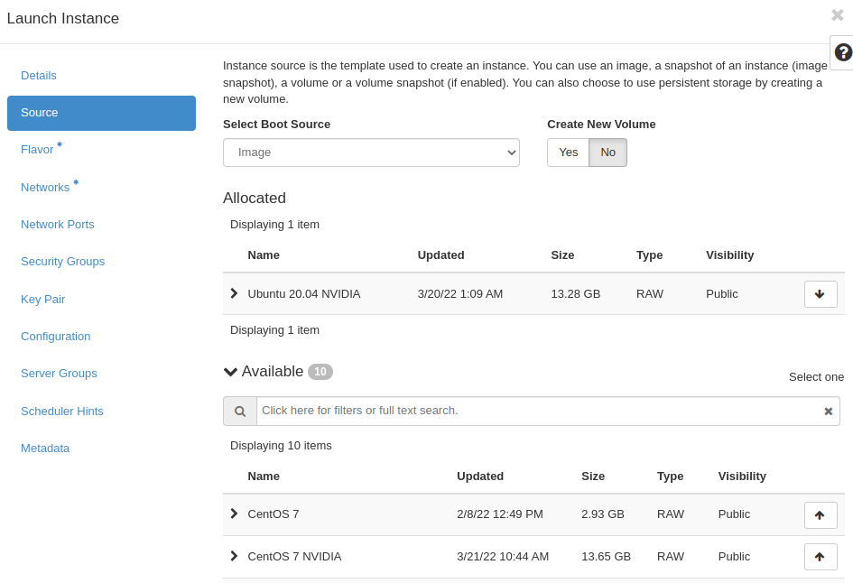

Choose Flavor (eg. vm.a6000.1)

The corresponding flavours with vgpu are: vm.a6000.1, vm.a6000.2, vm.a6000.4, vm.a6000.8
AMD-based servers with NVIDIA RTX A6000 cards

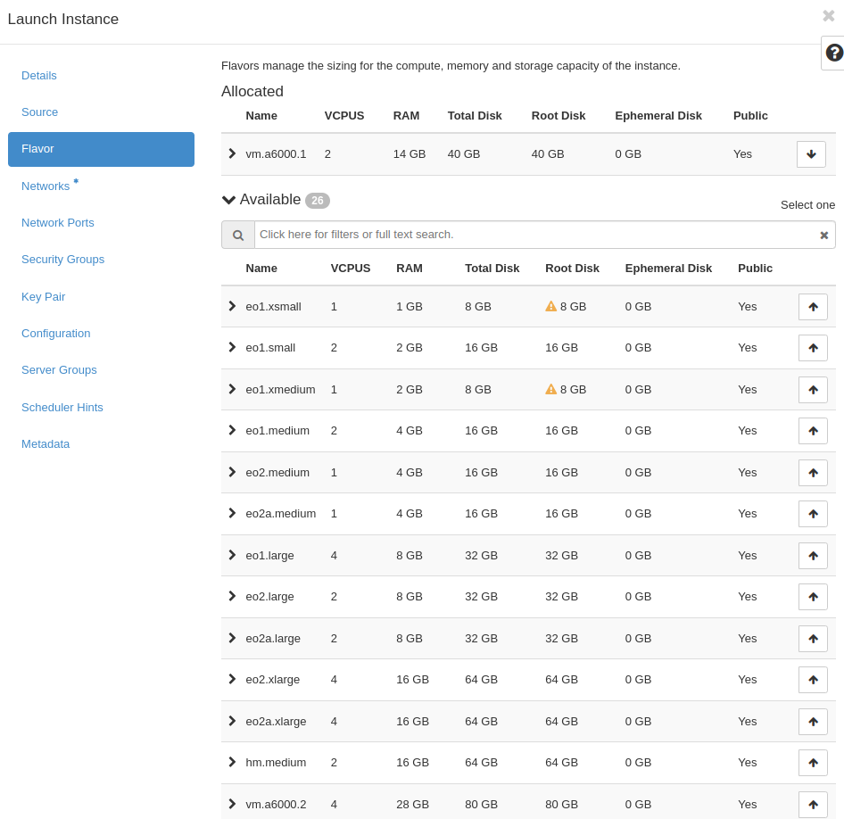

Click "Networks" and then choose desired networks.

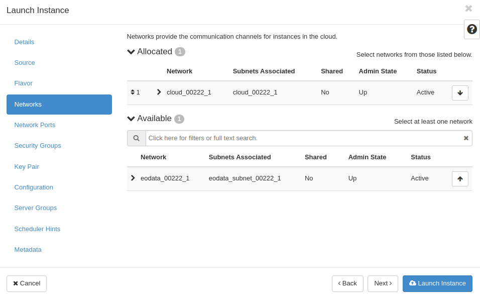

Open "Security Groups" After that, choose "allow_ping_ssh_icmp_rdp" and "default".

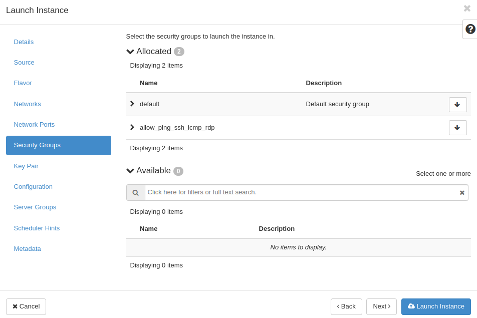

Choose or generate SSH keypair `HOW TO CREATE KEY-PAIR IN OPENSTACK DASHBOARD? <https://cloudferro-cf3.readthedocs-hosted.com/en/latest/general/keypairopenstack/keypairopenstack.html>`_ for your VM. Next, launch your instance by clicking on blue button.

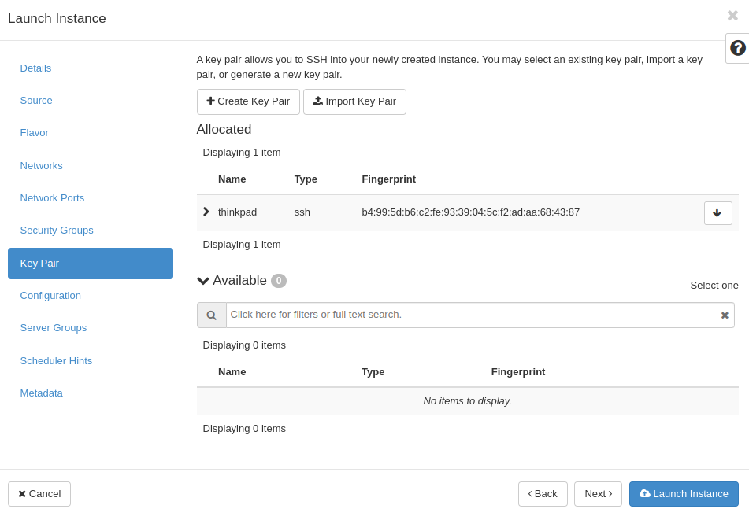

You will see "Instances" menu with your newly created VM.

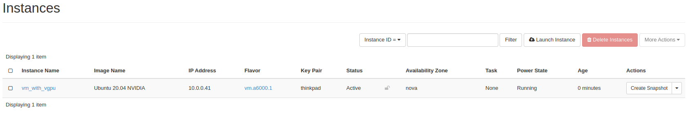

Open the drop-down menu and choose "Console".

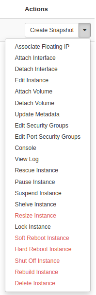

 Click on the black terminal area (to activate access to the console). Type: eoconsole and hit Enter.

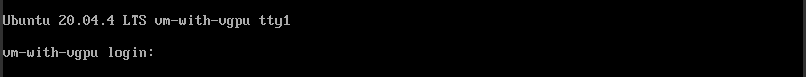

Insert and retype new password.

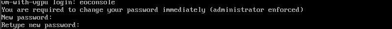

Now you can type commands. 

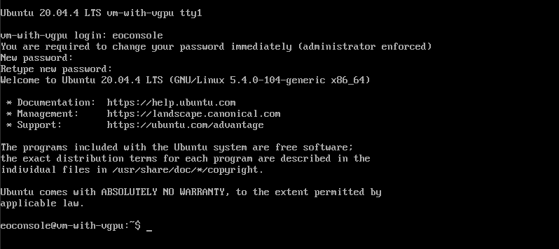

To check the status of the vgpu device, enter the command: nvidia-smi

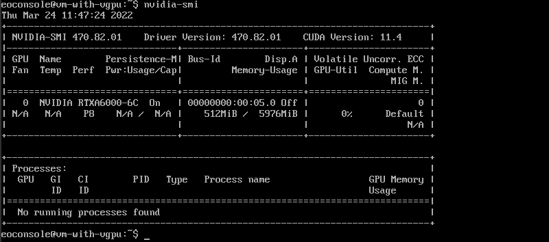

After you finish, type "exit".

This will close the session.

If you want to make your VM accessible from the Internet check `here <https://cloudferro-cf3.readthedocs-hosted.com/en/latest/networking/addremovefip/addremovefip.html>`_.
