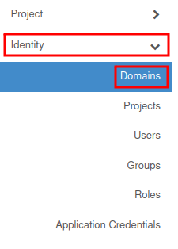
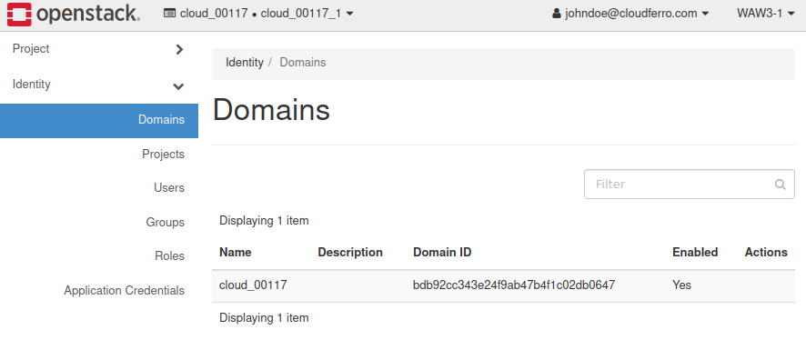

What is an OpenStack domain?
============================

**Domain**

Intention of providing a domain in cloud environment is to define boundaries for management. OpenStack domain is a type of a container for projects, users and groups.
One crucial benefit is separating overlapping resource names for different domains.
Furthermore, permissions in the project and domain are two not related things, hereby customization for administrator is made up much easier.

Current domain name is **visible** beside the project that is currently selected in the Horizon panel.

You may also check all domains connected to your account by choosing **Identity → Domains**.

Domains list:

|

**Service relation**

CREODIAS account is linked to your main account in particular domain, hence it allows you to login to the OpenStack dashboard without any need to deliver keystone credentials.

This type of facility is due to a proper implementation of KeyCloak and KeyStone relation.

|

**Docs**

For OpenStack docs I refer you to the link: `Domains <https://docs.openstack.org/security-guide/identity/domains.html>`_

