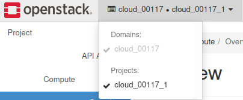

What is an OpenStack project?
=============================

A **project** is a isolated group of zero or more users who share common access with specific privileges to the software instance in `OpenStack <https://www.credosystemz.com/courses/openstack-training-chennai/?utm_campaign=Quora+traffic&utm_medium=referral&utm_source=Quora>`_. A project is created for each set of instances and networks that are configured as a discrete entity for the project. In Compute, a project owns virtual machines (in Compute) or containers (in Object Storage).

You can imagine that the whole OpenStack cloud  is a big cake of resources (vCPU, disks, instances, etc…) and projects are the pieces of this cake served to the customers.

Current project name is **visible** in the Horizon panel.

