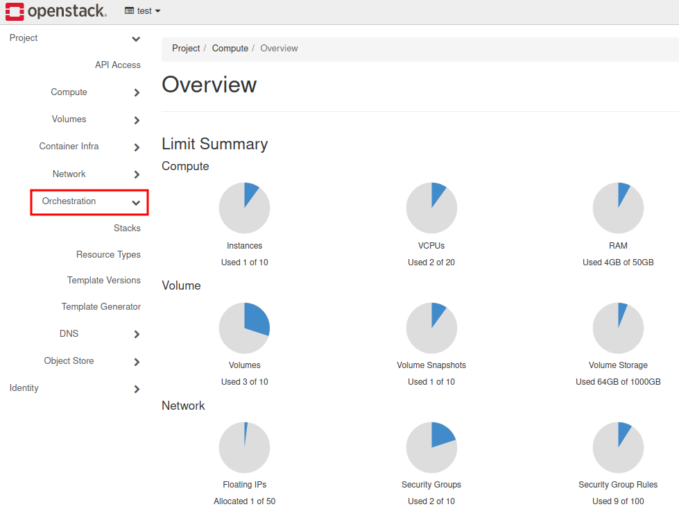
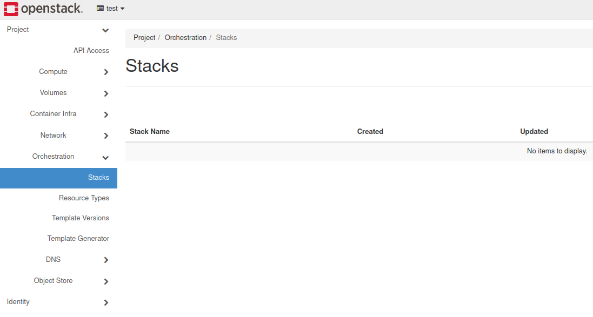
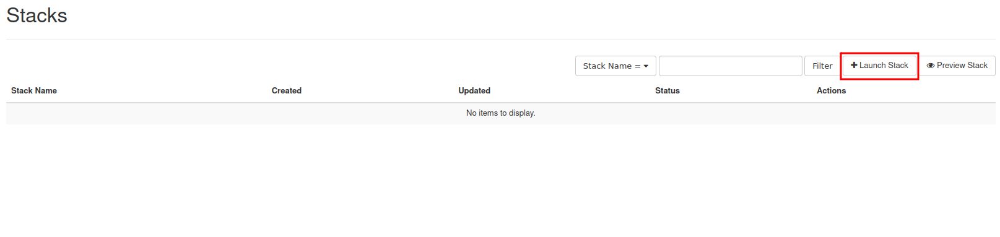
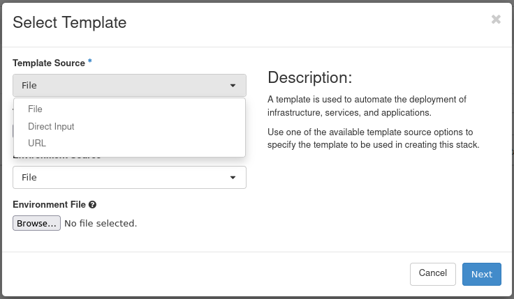

How to create a set of VMs using OpenStack Heat (Orchestration)?
=================================================================

Heat is an OpenStack component responsible for Orchestration. Its purpose is to deliver automation engine and optimize processes.
Heat uses templates in most-popular for devops culture syntax → yaml. Those templates describe the whole infrastructure that you are able to deploy. The deployed environment is being called stack. It can consists of many different resources.

You can leverage Heat templates using python-heatclient in CLI or using Horizon dashboard in the web browser.

**CLI**

For installing python-heatclient run pip command (strongly recommended virtual environment activated):

::

   pip install python-heatclient

To run a prepared template in order to deploy a stack, you have to use this command:

::

   openstack stack create -t template.yml <stackname>
 
   -t : assign template for deployment
 
   <stackname>: defines a name for the stack

**GUI**

Log in to the Horizon dashboard and choose **Orchestration** tab.

Click on the **Stacks**.

Navigate to the right part of the screen and choose **“Launch Stack”**.

Enroll Template Source selector and choose a particular file, Direct Input or URL to your template.

**Basic template**

Using this snippet, you can create one virtual machine, booted from ephemeral disk.

::

   heat_template_version: 2015-04-30       
                                        
   resources:                              
     instance:                             
       type: OS::Nova::Server              
       properties:                         
         flavor: eo1.xsmall                
         image: Ubuntu 18.04 LTS (19.18)
         networks:                         
           - network: private_network_0XXXX
           - network: eodata               
         key_name: your_key
         security_groups:
           - allow_ping_ssh_rdp
           - default     
                                            

**Explanation**

**heat_template_version** → strictly a version of heat template. Each of them varies in many ways (including different modules support, more parameters customization etc.)

**resources** → entry to commence providing particular components for deployment

**instance** → name of resource (you can type in anything on your own)

**type** → definition of an OpenStack component (a comprehensive list: https://docs.openstack.org/heat/latest/template_guide/openstack.html)

**properties** → under this tab provide required parameters for deploying an component (in the case of virtual machine such as flavor, image networks etc.)

.. note::

   Please customize the filled-in values for your project purposes.

.. attention::

   Check if you are using tabs for indentation. YAML doesn’t allow tabs; it requires spaces.

