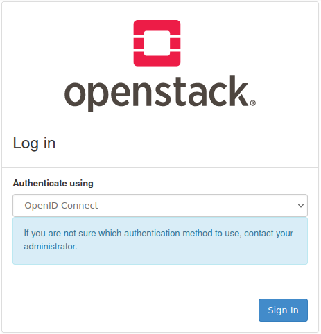
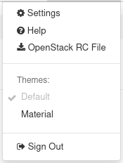
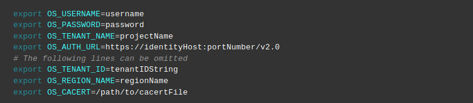

How to install OpenStackClient (Linux)?
=======================================

**OpenStackClient** is very useful tool to gain a powerful management of our projects in Command Line Interface. It implements new features and advantages: You can run the commands from the CLI, or include prepared scripts in Python to automate the functionality of your cloud storage. Moreover we could reach our OpenStack access on any computer if we inset credentials (username and password).

Eventually everyone may admit that generally OpenStackClient provides more opportunities to look into our compute facility deeply and much more precisely.

 

.. Attention::

It is strongly recommended to use virtual environments which do not affect system variables globally. If something goes wrong, everything is happening in separated space.

 

FAQ covers installation of OpenStackClient under Ubuntu 20.04 LTS and Python 3.
Installation under other distros may be simillar.

 

Before we start, you might consider running below code in a virtual environment:

::

   sudo apt install python3-venv
   python3 -m venv openstack_cli
   source openstack_cli/bin/activate
   
 
Firstly, run apt-get update:

::

   sudo apt update

 
Install python3-pip:

::

   sudo apt install python3-pip

 
Install setuptools:

::

   sudo python3 -m pip install setuptools

 
If you intend to use newer version of python, eg. 3.8.2 - you have to install python3.8-dev and reinstall netifaces python module which may cause problems. Remember to run pip commands with appropiate python version (eg. change python3 -m pip to python3.8 -m pip)

::

  sudo apt install python3.8-dev
  sudo python3.8 -m pip install --upgrade netifaces

 
Finally install python-openstackclient:

::

   sudo python3 -m pip install python-openstackclient

 

After this, you should be able to run openstack command from consone, eg:

::
   
   openstack --help

 

If everything seems to work, we might firmly move on to our Horizon Panel.

Log in to your account. 

Head straight to our email button in the upper-right-corner. Click on it.

Choose **OpenStack RC File**.

Save your RC file on your disk.

If you use some text editor like vim it should consist of many variables related to your domain account like it:

Change your **directory** to downloading destination and **execute** the configuration file:

For example it will look like: cloud_xxxxx\test-openrc.sh

Time to run this **sh** file. The prompted message will ask you for your domain **password**. Type it in and press **enter**. If the password is correct then you've got access **granted**.

::
   
   . cloud_xxxxx/test-openrc.sh
   
   Please enter your OpenStack Password for project test as user johndoe:
   
 

After that you can eg. check list of your servers by typing in console:

::

   openstack server list
   

Output of this command should contain table with ID, Name, Status, Networks, Image and Flavor of your virtual machines.

 

 

I recommend you to check Openstack documentation which contains lists of available commands. There you may reconsider many scenarios linked with your management.
 
